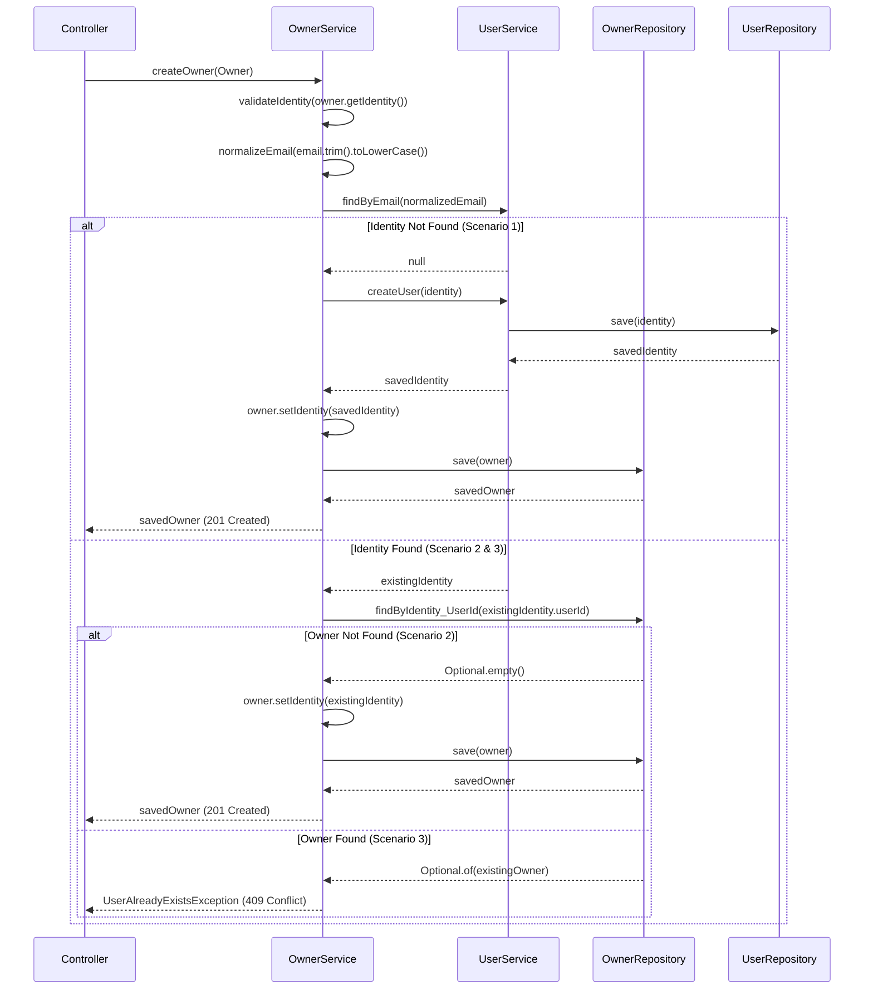

# ADR-001: Owner Identity Management Business Logic

## Status
**Accepted** - *Date: 2025-09-05*

## Context
CloudSuites property management system requires robust handling of owner creation with proper Identity/Owner relationship management. The system supports multi-persona users where a single Identity can have multiple roles (Owner, Tenant, Staff, Admin) across different buildings.

## Decision

### Business Rules
1. **Identity Uniqueness**: Each email address maps to exactly one Identity record
2. **Owner Uniqueness**: Each Identity can have at most one Owner record  
3. **Multi-Persona Support**: An Identity can simultaneously be Owner, Tenant, Staff, or Admin
4. **Email Normalization**: All emails are trimmed and converted to lowercase for consistency

### Decision Table

| Scenario | Identity Exists? | Owner Exists? | Action | HTTP Status | Exception |
|----------|------------------|---------------|---------|-------------|-----------|
| 1        | No               | No            | Create Identity + Owner | 201 Created | None |
| 2        | Yes              | No            | Create Owner (reuse Identity) | 201 Created | None |
| 3        | Yes              | Yes           | Reject Request | 409 Conflict | UserAlreadyExistsException |
| 4        | Invalid Email    | N/A           | Reject Request | 400 Bad Request | InvalidOperationException |
| 5        | Missing Identity | N/A           | Reject Request | 400 Bad Request | InvalidOperationException |

### Sequence Diagram

## Transaction Management
- All owner creation operations are wrapped in `@Transactional`
- Rollback occurs on any exception to maintain data consistency
- User role assignments are persisted after successful owner creation

## Concurrency Considerations
- Database unique constraints on email field provide ultimate consistency
- Race conditions between identity existence check and creation are handled by constraint violations
- Constraint violations are converted to appropriate business exceptions

## Consequences

### Positive
- Clear separation of concerns between Identity and Owner management
- Robust handling of edge cases and error conditions
- Support for multi-persona users across the platform
- Consistent email normalization prevents duplicate issues

### Negative
- Additional complexity in owner creation logic
- Requires careful transaction management
- Need for comprehensive testing of all scenarios

## Implementation Notes
- Email normalization: `email.trim().toLowerCase()`
- Identity validation occurs before any database operations
- User roles are created and persisted after successful owner creation
- All operations are logged for audit trail

## Testing Strategy
- Unit tests covering all decision table scenarios
- Integration tests for transaction rollback scenarios
- Concurrency tests using parallel execution
- Mock repository tests for constraint violation handling
